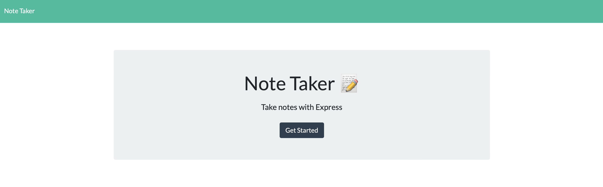
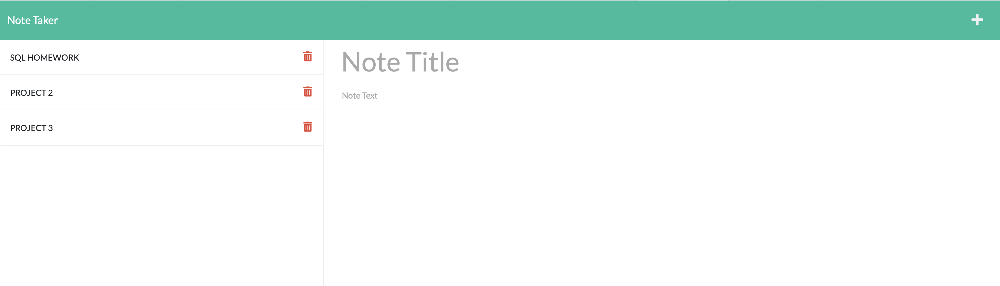

# Node Taker

Deployed: https://thawing-ridge-75547.herokuapp.com/

Repo: https://github.com/vi3t4lov3/Note-Taker-by-ExpressJS

## Description

This assignment is to modify starter code to create an application called Note Taker that can be used to write and save notes. This application will use an Express.js back end and will save and retrieve note data from a JSON file.

The application’s front end has already been created. It's your job to build the back end, connect the two, and then deploy the entire application to Heroku.

## Table of Contents

- [Node Taker](#node-taker)
  - [Description](#description)
  - [Table of Contents](#table-of-contents)
  - [Dependencies](#dependencies)
  - [Installation](#installation)
  - [Usage](#usage)
  - [Contribute](#contribute)
  - [Tests](#tests)
  - [Demo](#demo)
  - [Questions](#questions)
  - [License](#license)

## Dependencies

- HTML
- CSS, Bootstrap
- Javascript (OOP, Node.js, ExpressJS, UUID)

## Installation

You can run a local copy of this site by issuing the following commands.

```bash
$ git clone https://github.com/vi3t4lov3/Note-Taker-by-ExpressJS.git
$ cd Note-Taker-by-ExpressJS
```

## Usage

```md
GIVEN a note-taking application
WHEN I open the Note Taker
THEN I am presented with a landing page with a link to a notes page
WHEN I click on the link to the notes page
THEN I am presented with a page with existing notes listed in the left-hand column, plus empty fields to enter a new note title and the note’s text in the right-hand column
WHEN I enter a new note title and the note’s text
THEN a Save icon appears in the navigation at the top of the page
WHEN I click on the Save icon
THEN the new note I have entered is saved and appears in the left-hand column with the other existing notes
WHEN I click on an existing note in the list in the left-hand column
THEN that note appears in the right-hand column
WHEN I click on the Write icon in the navigation at the top of the page
THEN I am presented with empty fields to enter a new note title and the note’s text in the right-hand column
```

## Contribute

1. Fork it
2. Create your feature branch (`git checkout -b my-new-feature`)
3. Commit your changes (`git commit -am 'Add some feature'`)
4. Push to the branch (`git push origin my-new-feature`)
5. Create new Pull Request

## Tests

```
NO TEST THIS TIME
```

## Demo

[Click here] (https://thawing-ridge-75547.herokuapp.com)





## Questions

If you have questions about this repository reach me by Github: [vi3t4lov3](https://github.com/vi3t4lov3)
or send an email: tuinfor@ymail.com

## License

[](https://opensource.org/licenses/MIT)
